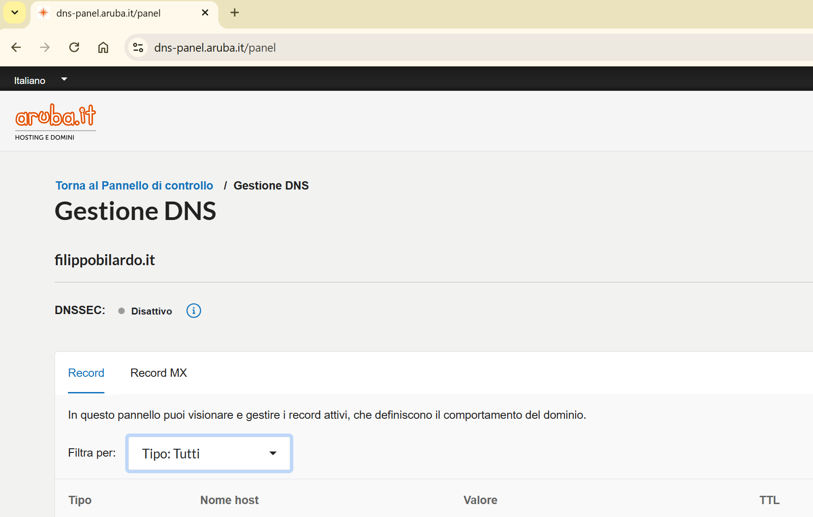
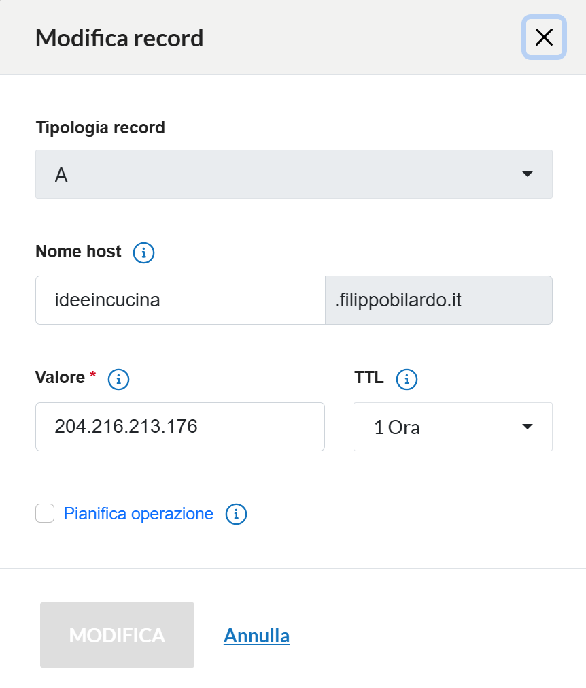
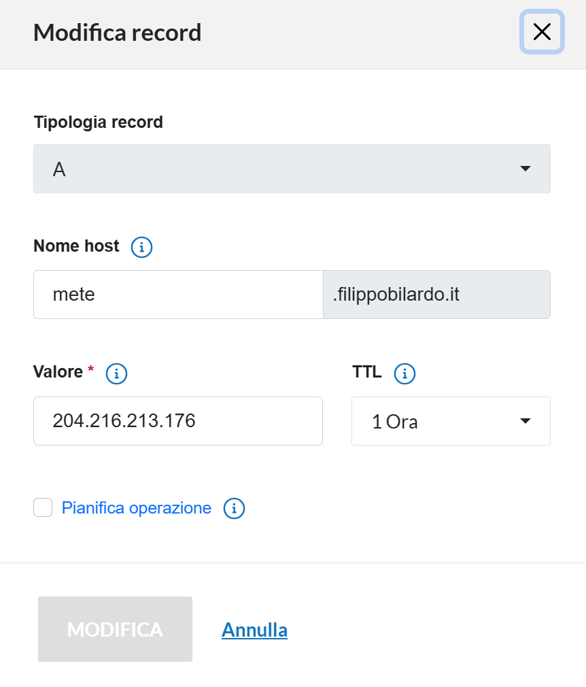

# Guida alla Configurazione DNS con Aruba.it

## Introduzione

Questa guida illustra come configurare i record DNS (Domain Name System) utilizzando il pannello di controllo di **Aruba.it**, uno dei principali service provider italiani per servizi di hosting e registrazione domini.

Il DNS è il sistema che traduce i nomi di dominio leggibili (es. `www.example.com`) in indirizzi IP numerici che i computer utilizzano per comunicare in rete.

## Prerequisiti

- Un dominio registrato presso Aruba.it
- Accesso al pannello di controllo Aruba
- Credenziali di accesso (username e password)

## Accesso al Pannello di Controllo DNS

### Passo 1: Login al Pannello Aruba



Per accedere alla configurazione DNS:

1. Collegarsi al sito [www.aruba.it](https://www.aruba.it)
2. Effettuare il login con le proprie credenziali
3. Selezionare il dominio da configurare dalla lista dei domini posseduti
4. Accedere alla sezione **"Gestione DNS"** o **"Pannello DNS"**

## Configurazione dei Record DNS

### Tipi di Record DNS Principali

I record DNS più comuni che si possono configurare sono:

- **A Record**: Associa un nome di dominio a un indirizzo IPv4
- **AAAA Record**: Associa un nome di dominio a un indirizzo IPv6
- **CNAME Record**: Crea un alias per un altro dominio
- **MX Record**: Definisce i server di posta elettronica
- **TXT Record**: Contiene informazioni testuali (es. verifica dominio, SPF)

### Esempio 1: Configurazione Sottodominio - ideeincucina



**URL finale**: [https://ideeincucina.filippobilardo.it/](https://ideeincucina.filippobilardo.it/)

Per configurare un sottodominio come `ideeincucina.filippobilardo.it`:

1. Nel pannello DNS, cliccare su **"Aggiungi record"**
2. Selezionare il tipo di record **A** o **CNAME**
3. Inserire il nome del sottodominio: `ideeincucina`
4. Specificare l'indirizzo IP di destinazione (per A record) o il dominio target (per CNAME)
5. Impostare il TTL (Time To Live) - valore consigliato: 3600 secondi (1 ora)
6. Salvare la configurazione

### Esempio 2: Configurazione Sottodominio - blog


**URL finale**: [https://blog.filippobilardo.it/](https://blog.filippobilardo.it/)

Per configurare il sottodominio `blog.filippobilardo.it`:

1. Aggiungere un nuovo record DNS
2. **Tipo**: A o CNAME
3. **Nome/Host**: `blog`
4. **Valore**: indirizzo IP del server web o nome dominio di destinazione
5. **TTL**: 3600 (o valore desiderato)
6. Confermare e salvare

### Esempio 3: Configurazione Sottodominio - mete



**URL finale**: [https://mete.filippobilardo.it/](https://mete.filippobilardo.it/)

Per il sottodominio `mete.filippobilardo.it`:

1. Creare un nuovo record DNS
2. **Tipo**: A o CNAME
3. **Nome/Host**: `mete`
4. **Valore**: IP del server o dominio target
5. **TTL**: 3600
6. Salvare le modifiche

### Configurazione Dominio Principale

Per configurare il dominio principale `filippobilardo.it` e `www.filippobilardo.it`:

#### Dominio Root (filippobilardo.it)

1. Aggiungere un record di tipo **A**
2. **Nome/Host**: `@` (rappresenta il dominio root)
3. **Valore**: indirizzo IP del server web principale
4. **TTL**: 3600

#### Sottodominio WWW (www.filippobilardo.it)

Esistono due approcci:

**Opzione A - Record A diretto:**
- **Tipo**: A
- **Nome/Host**: `www`
- **Valore**: stesso IP del dominio root

**Opzione B - CNAME (consigliato):**
- **Tipo**: CNAME
- **Nome/Host**: `www`
- **Valore**: `filippobilardo.it`

## Tempi di Propagazione

Dopo aver salvato le modifiche DNS, è importante considerare:

- **Propagazione locale**: 15-30 minuti
- **Propagazione globale**: 24-48 ore (in casi estremi)
- Il TTL impostato influenza la velocità di aggiornamento

Durante questo periodo, alcuni utenti potrebbero vedere ancora la vecchia configurazione.

## Verifica della Configurazione

### Strumenti di Verifica Online

- **nslookup**: comando da terminale
- **dig**: comando da terminale (Linux/Mac)
- **DNS Checker**: [https://dnschecker.org](https://dnschecker.org)
- **MX Toolbox**: [https://mxtoolbox.com](https://mxtoolbox.com)

### Verifica da Terminale

```bash
# Verifica record A
nslookup blog.filippobilardo.it

# Verifica dettagliata con dig (Linux/Mac)
dig blog.filippobilardo.it

# Verifica specifica del tipo di record
dig blog.filippobilardo.it A
```

## Best Practices

1. **Backup della configurazione**: Annotare sempre i record DNS esistenti prima di modificarli
2. **TTL basso durante le modifiche**: Impostare un TTL basso (es. 300 secondi) prima di fare modifiche importanti
3. **Verifica graduale**: Testare i cambiamenti prima di propagarli completamente
4. **Certificati SSL**: Dopo la configurazione DNS, configurare i certificati SSL per HTTPS
5. **Monitoraggio**: Verificare periodicamente che i record DNS siano corretti

## Risoluzione Problemi Comuni

### Il sito non è raggiungibile dopo la configurazione

- Verificare che l'IP inserito sia corretto
- Controllare che il server web sia attivo e raggiungibile
- Attendere la completa propagazione DNS (fino a 48 ore)

### Alcuni utenti vedono il vecchio sito

- Normale durante la propagazione DNS
- Suggerire di svuotare la cache DNS locale:
  ```bash
  # Windows
  ipconfig /flushdns
  
  # Linux
  sudo systemd-resolve --flush-caches
  
  # Mac
  sudo dscacheutil -flushcache
  ```

### Errori di certificato SSL

- Attendere che il DNS sia propagato prima di configurare SSL
- Verificare che il certificato copra tutti i sottodomini necessari

## Conclusioni

La configurazione DNS con Aruba.it è un processo relativamente semplice attraverso il pannello di controllo web. È fondamentale:

- Pianificare attentamente le modifiche DNS
- Documentare tutti i record configurati
- Verificare sempre le modifiche dopo la configurazione
- Essere pazienti durante la propagazione DNS

Con una corretta configurazione DNS, è possibile gestire efficacemente domini principali e sottodomini, indirizzando il traffico verso i server corretti e garantendo che gli utenti possano raggiungere i propri siti web e servizi online.

## Riferimenti

- [Documentazione ufficiale Aruba](https://www.aruba.it)
- [RFC 1035 - Domain Names](https://www.rfc-editor.org/rfc/rfc1035)
- [DNS Best Practices](https://www.icann.org/)

