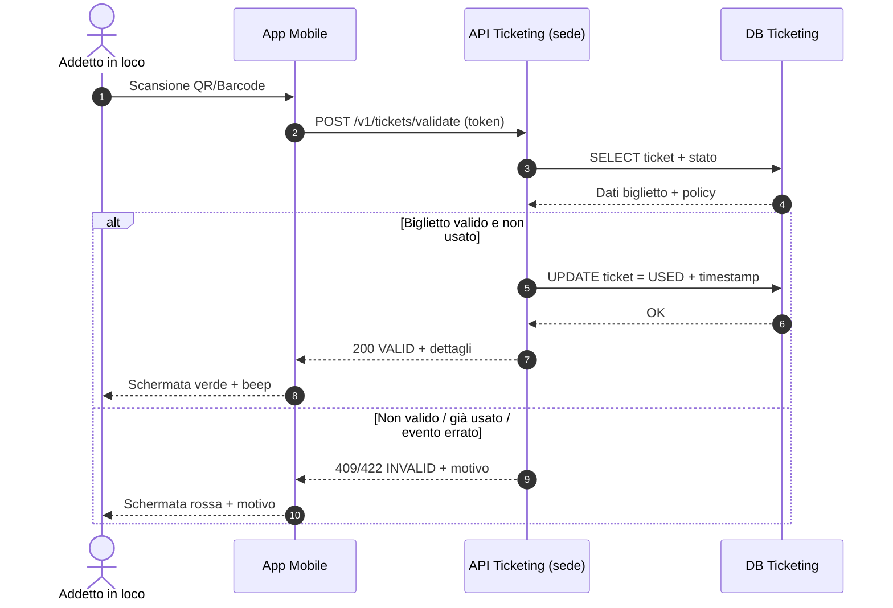

# Sequenza: validazione biglietto (QR)

> Usare per la **Prima Parte – Punto 2 (validazione biglietti)**.

## Variante: modalità offline (fallback)

- L’app conserva una **cache firmata** di ticket attesi per quel varco/slot.
- Se rete assente, valida localmente la firma e registra in coda.
- Alla riconnessione, invia `POST /v1/tickets/sync` con gli eventi di uso.
