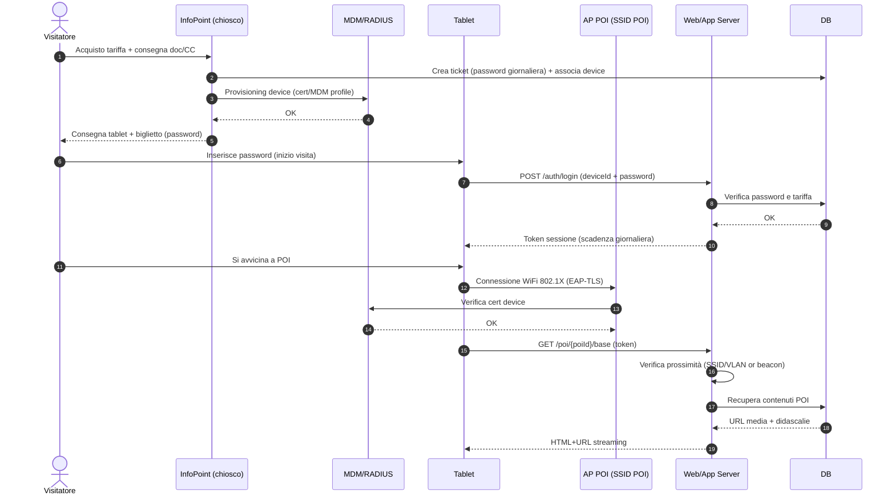

# Sequenza accesso contenuti POI

> Riferimento: **vincoli progettuali** (solo tablet, password biglietto, prossimità POI, contenuti su server).

```mermaid
sequenceDiagram
  autonumber
  actor Vis as Visitatore
  participant K as InfoPoint (chiosco)
  participant MDM as MDM/RADIUS
  participant T as Tablet
  participant AP as AP POI (SSID POI)
  participant W as Web/App Server
  participant DB as DB

  Vis->>K: Acquisto tariffa + consegna doc/CC
  K->>DB: Crea ticket (password giornaliera) + associa device
  K->>MDM: Provisioning device (cert/MDM profile)
  MDM-->>K: OK
  K-->>Vis: Consegna tablet + biglietto (password)

  Vis->>T: Inserisce password (inizio visita)
  T->>W: POST /auth/login (deviceId + password)
  W->>DB: Verifica password e tariffa
  DB-->>W: OK
  W-->>T: Token sessione (scadenza giornaliera)

  Vis->>T: Si avvicina a POI
  T->>AP: Connessione WiFi 802.1X (EAP-TLS)
  AP->>MDM: Verifica cert device
  MDM-->>AP: OK

  T->>W: GET /poi/{poiId}/base (token)
  W->>W: Verifica prossimità (SSID/VLAN or beacon)
  W->>DB: Recupera contenuti POI
  DB-->>W: URL media + didascalie
  W-->>T: HTML+URL streaming
```
